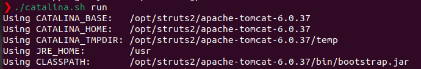
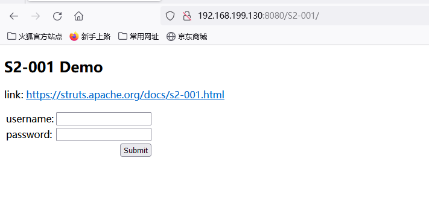
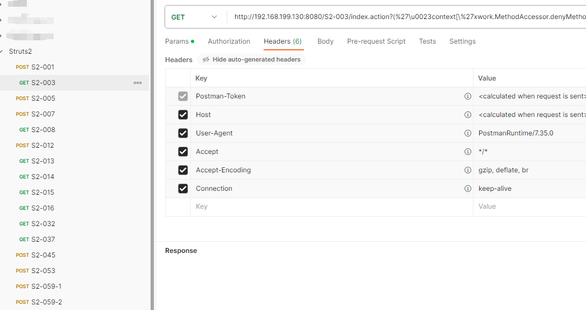
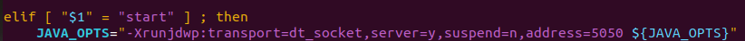
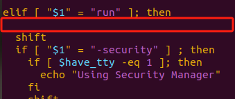
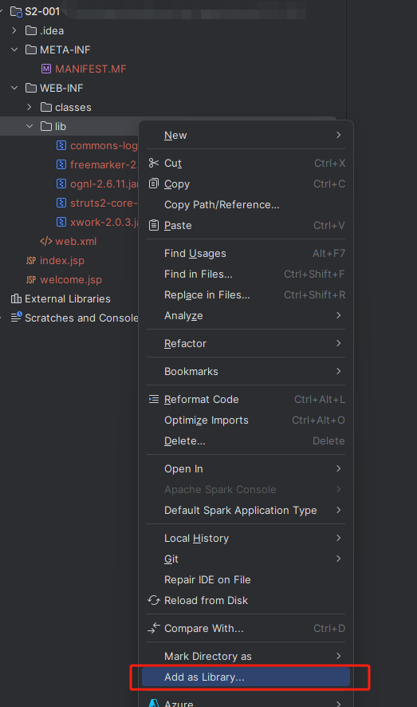

# Struts2漏洞环境

虽然Struts2已经慢慢没什么人用了，但是仍然很有学习价值，尤其是对于OGNL表达式注入漏洞的深入学习有很大帮助，整理漏洞环境帮助各位师傅节省时间。

## 使用方法

将war包放入`tomcat`的`webapp`目录下，推荐使用[Tomcat6.0.37](https://archive.apache.org/dist/tomcat/tomcat-6/v6.0.37/bin/)和`JDK8`，可以去连接中下载对应操作系统的版本，将war放进去之后使用启动`tomcat`访问：http://ip:port/S2-0xx即可开始测试，如果访问显示404则可以再加上`index.action`、`index.jsp`等类似字样（大家应该都懂），具体可以查看`postman`中的路径。

## POC

漏洞的触发POC放在了`json`文件中，导入`postman`即可使用（当然也可以自己写或者用别的扫描器）

## 关于DEBUG

如果你使用`start`来启动，那么就在`catalina.sh`的这个地方添加`JAVA_OPTS="-Xrunjdwp:transport=dt_socket,server=y,suspend=n,address=5050 ${JAVA_OPTS}"`

`run`同理，在这里添加

或者直接用`debug`好像也行（因为本人测试IAST的缘故所以没有用过`debug`，都是一方便就直接改了）

调试的时候解压`war`包，然后添加`lib`就可以调试`class`文件了，也可以查看和`debug` `jar`包的内容了：

